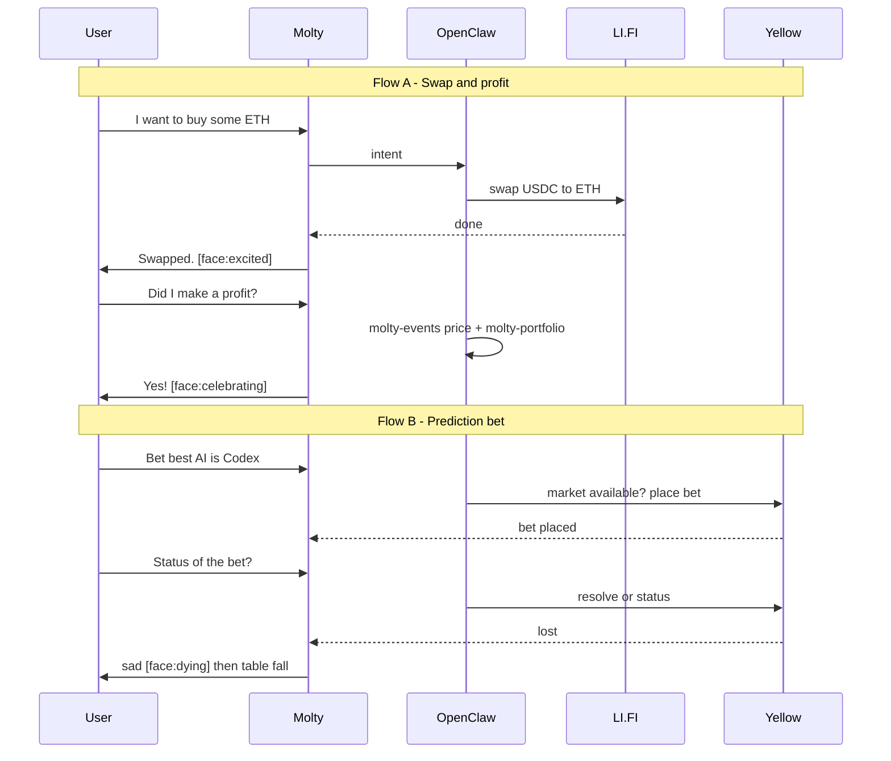

# 🦞 Molty — Architecture & System Design

### _Your DeFi Prediction Robot Powered by OpenClaw_

**HackMoney 2026 | ETHGlobal**

---

## 1. Project Overview

**Molty** is a physical desk robot that acts as your personal DeFi prediction market agent. It listens to your voice, fetches live market data, places onchain bets on your behalf using state channels for instant settlement, tracks your positions in real-time, and physically reacts to outcomes — dancing when you win, and dramatically falling off the table when you lose.

The name is a tribute to OpenClaw's heritage — the project was originally called "Moltbot" before becoming OpenClaw. Molty is the lobster that bets, dances, and occasionally dies for your portfolio.

The robot's brain runs on **OpenClaw** (deployed on AWS EC2), giving it autonomous agentic capabilities — browsing, executing transactions, remembering context, and managing your DeFi positions 24/7.

### Tagline

> _"The only DeFi agent that literally dies for your losses."_

### Hackathon Demo Flows (Submission)

We demo **two flows** for judges:

**Flow A — Swap and profit check**

1. User: "I want to buy some ETH."
2. Moltbot swaps the user's USDC to ETH via **molty-swap** (LI.FI).
3. After ~2 minutes, user: "Did I make a profit?"
4. Bot checks (e.g. **molty-events** for current ETH price, **molty-portfolio** for position) and says yes, then **celebrates** (face `celebrating`, motors).

**Flow B — Prediction bet (Yellow)**

1. User: "I want to bet that the best AI this month is Codex."
2. OpenClaw checks if the market is available (Yellow) and places the bet (backend Yellow integration: app session, submit prediction state).
3. User: "What is the status of the bet?"
4. Bot checks the market on Yellow; user has **lost**.
5. Bot becomes very sad and **falls off the table** (face `dying`, motor animation `tableFall`).

### Why These Demos Work for Judges

- **Flow A** — Shows LI.FI (swap USDC→ETH) and voice-driven profit check; always live (crypto 24/7).
- **Flow B** — Shows Yellow state channels for prediction markets (check market, place bet, resolve); memorable physical reaction (table fall) on loss.
- **Two integrations** — One flow highlights LI.FI; the other highlights Yellow. Both resonate with ETHGlobal judges.

---

## 2. Target Prizes (3 Partner Slots + Finalists)

ETHGlobal allows a maximum of 3 partner selections. Finalists is automatic.

| Prize                   | Amount                | Fit          | Why Selected                                                                                      |
| ----------------------- | --------------------- | ------------ | ------------------------------------------------------------------------------------------------- |
| **Yellow Network**      | $15,000               | 🎯 PARTNER 1 | Prediction market is their listed example. State channels = gasless instant bets. Highest prize.  |
| **Arc (Circle)**        | $10,000               | 🎯 PARTNER 2 | "Agentic Commerce" prize is literally Molty — autonomous agent executing USDC txns.               |
| **LI.FI**               | $6,000                | 🎯 PARTNER 3 | "AI x LI.FI Smart App" — AI agent using LI.FI for cross-chain execution. Low effort, high impact. |
| **HackMoney Finalists** | $1,000/member + perks | 🏆 AUTO      | Physical robot demo is instant finalist material. Top 10 teams.                                   |

**Total potential: $31,000+ plus finalist perks (hoodie, $500 flight, $10K AWS credits)**

### Partners NOT Selected (and why)

- **ENS ($5K):** Pool prize split among ALL qualifying projects — diluted value. Not worth a partner slot.
- **Uniswap ($10K):** v4 hooks/AMM don't align with what Molty does. Would feel forced.
- **Sui ($10K):** Requires Move language + entirely different chain. Too much pivoting for 3 days.

---

## 3. High-Level Architecture

```
┌─────────────────────────────────────────────────────────┐
│                    PHYSICAL ROBOT                        │
│  ┌──────────┐  ┌──────────┐  ┌──────────┐              │
│  │  Screen   │  │  Motors  │  │   Mic    │              │
│  │ (TFT/LCD)│  │(Arms +   │  │(Audio In)│              │
│  │  Faces   │  │ Wheels)  │  │          │              │
│  └────┬─────┘  └────┬─────┘  └────┬─────┘              │
│       │              │              │                    │
│  ┌────┴──────────────┴──────────────┴────┐              │
│  │     Microcontroller (ESP32 / RPi)     │              │
│  │     - Renders face animations         │              │
│  │     - Controls servo/DC motors        │              │
│  │     - Captures audio                  │              │
│  │     - WebSocket client to EC2         │              │
│  └───────────────────┬───────────────────┘              │
└──────────────────────┼──────────────────────────────────┘
                       │ WebSocket (wss://)
                       │
┌──────────────────────┼──────────────────────────────────┐
│              AWS EC2 INSTANCE                            │
│  ┌───────────────────┴───────────────────┐              │
│  │           OpenClaw Gateway              │              │
│  │  - Receives voice/text commands        │              │
│  │  - LLM reasoning (Claude/GPT)         │              │
│  │  - Skill execution engine             │              │
│  │  - Persistent memory                  │              │
│  └───────┬──────────┬──────────┬─────────┘              │
│          │          │          │                         │
│  ┌───────┴───┐ ┌────┴────┐ ┌──┴──────────┐             │
│  │  Speech   │ │  DeFi   │ │   Robot     │             │
│  │  Engine   │ │  Skills │ │   Control   │             │
│  │           │ │         │ │   Skill     │             │
│  │ STT:Whisper│ │-Yellow  │ │             │             │
│  │ TTS:Kokoro│ │ SDK     │ │-Face states │             │
│  │           │ │-LI.FI   │ │-Motor cmds  │             │
│  │           │ │-Arc/    │ │-Animations  │             │
│  │           │ │ Circle  │ │             │             │
│  │           │ │-Events  │ │             │             │
│  └───────────┘ └─────────┘ └─────────────┘             │
│                                                         │
│  ┌─────────────────────────────────────────┐            │
│  │         Wallet & Key Management          │            │
│  │  - User's wallet (delegated session)    │            │
│  │  - Yellow state channel session         │            │
│  │  - Transaction signing                  │            │
│  └─────────────────────────────────────────┘            │
└─────────────────────────────────────────────────────────┘
                       │
                       │ On-chain
                       ▼
┌─────────────────────────────────────────────────────────┐
│                   BLOCKCHAIN LAYER                       │
│                                                         │
│  ┌──────────────┐  ┌──────────────┐  ┌──────────────┐  │
│  │   Yellow      │  │   LI.FI     │  │    Arc       │  │
│  │   Nitrolite   │  │   Router    │  │   (Circle)   │  │
│  │              │  │              │  │              │  │
│  │ State channel │  │ Cross-chain │  │ USDC settle- │  │
│  │ for instant  │  │ asset       │  │ ment layer   │  │
│  │ off-chain    │  │ routing     │  │ + Circle     │  │
│  │ bets         │  │ for funding │  │ Wallets      │  │
│  └──────────────┘  └──────────────┘  └──────────────┘  │
│                                                         │
│  Settlement chains: Arc, Polygon, Base, Arbitrum, EVM   │
└─────────────────────────────────────────────────────────┘
```

**Demo flows:** Flow A uses **LI.FI** (molty-swap) for USDC→ETH. Flow B uses **Yellow** for prediction markets (check market, place bet, status, resolve); robot reacts on win/loss.

---

## 4. Component Breakdown

### 4.1 Physical Robot (Hardware Layer)

**Purpose:** Physical embodiment of the DeFi agent. Provides voice I/O, visual feedback (face + data), and physical reactions.

| Component | Hardware                              | Purpose                                   |
| --------- | ------------------------------------- | ----------------------------------------- |
| Brain     | ESP32-S3 or Raspberry Pi              | Main controller, WiFi, WebSocket client   |
| Screen    | TFT LCD (2.4" - 3.5") or phone screen | Face expressions + live bet data          |
| Arms      | 2x SG90 Servo motors                  | Up/down for dance/celebration             |
| Movement  | 2x DC motors + wheels                 | Forward/backward, the dramatic table fall |
| Audio In  | I2S MEMS Microphone (INMP441)         | Voice capture                             |
| Audio Out | Small speaker + I2S DAC               | Robot voice responses                     |
| Power     | LiPo battery or USB-C                 | Portable operation                        |

**Communication Protocol:**

```
Robot ←→ EC2: WebSocket (wss://)

Messages FROM EC2 to Robot:
  { type: "face",    state: "happy" | "sad" | "thinking" | "excited" | "dead" }
  { type: "screen",  data: { odds: "1.8x", position: "+$80", event: "RCB vs MI" } }
  { type: "motors",  action: "dance" | "forward" | "backward" | "fall" | "arms_up" | "arms_down" }
  { type: "audio",   data: "<base64 audio>" }

Messages FROM Robot to EC2:
  { type: "audio",   data: "<base64 audio from mic>" }
  { type: "button",  action: "confirm" | "cancel" }
  { type: "status",  battery: 85, connected: true }
```

### 4.2 OpenClaw Server (EC2 — Brain Layer)

**Purpose:** The agentic brain. Runs OpenClaw with custom skills for DeFi operations and robot control.

**Deployment:**

- AWS EC2 instance (t3.medium or larger)
- OpenClaw installed via CLI
- Custom skills directory for Molty-specific capabilities
- WebSocket server for robot communication

**Custom OpenClaw Skills** (see `molty/skills/` in repo):

```
molty/skills/
├── molty-soul/             # Personality and face directives (always on)
│   └── SKILL.md
├── molty-events/           # Live crypto prices (Stork oracle)
│   ├── SKILL.md
│   └── index.ts
├── molty-swap/             # On-chain token swaps via LI.FI
│   ├── SKILL.md
│   └── index.ts
└── molty-portfolio/        # Wallet token balances across chains
    ├── SKILL.md
    └── index.ts
```

**Prediction / betting:** Implemented via Yellow integration in the backend (`apps/backend/lib/yellow.js`). OpenClaw (or the kiosk) calls the backend to check market availability, place a bet, and check status. State-channel lifecycle is implemented in `research/yellow-swap/` (sandbox and production Base USDC); see also `HACK_DEMO.md` for LI.FI → Yellow on Base.

### 4.3 Yellow SDK Integration (Primary Prize Target)

**Purpose:** Gasless, instant prediction market bets via state channels. Used in **Flow B** (prediction bet), not for the swap itself — LI.FI handles swaps in Flow A.

**Flow (prediction bet — e.g. "best AI this month is Codex"):**

```
1. USER: "I want to bet that the best AI this month is Codex"
2. OpenClaw/backend checks if market is available (Yellow)
3. Backend opens Yellow state channel / app session (see research/yellow-swap)
4. Bet placed OFF-CHAIN via Nitrolite (instant, gasless)
5. User asks "What is the status of the bet?" → backend checks market on Yellow
6. On resolve (e.g. user lost): settle on-chain; robot reacts (face=dying, tableFall)
```

**Key Yellow Concepts Used:**

- **State Channels:** Lock funds once, transact off-chain (auth → create channel → app session).
- **App session:** Submit prediction state, close with final allocations; settlement on Base.
- **Nitrolite Protocol:** EIP-712 auth, ClearNet WebSocket; see `research/yellow-swap/yellow-swap.js` (sandbox) and `yellow-production.js` (Base mainnet USDC + custody). Also `apps/backend/lib/yellow.js` for create/resolve prediction flow.

**References:** `research/yellow-swap/`, `HACK_DEMO.md` (LI.FI on Base then Yellow on Base).

### 4.4 LI.FI Integration (Swap Flow — Flow A)

**Purpose:** On-chain token swaps. Used when the user says e.g. "I want to buy some ETH" — **molty-swap** calls LI.FI to swap USDC→ETH (or other pairs) on Base, Arbitrum, or Polygon.

```
User: "I want to buy some ETH"
Flow: OpenClaw → molty-swap skill → LI.FI quote + execute → swap USDC to ETH on-chain
```

Cross-chain funding (e.g. "use my DAI on Arbitrum") is supported the same way: LI.FI routes swap+bridge as needed. See `HACK_DEMO.md` for Base-focused demo (LI.FI to get USDC on Base, then Yellow for prediction).

### 4.5 Arc (Circle) Integration

**Purpose:** USDC settlement layer + agentic commerce infrastructure.

- **USDC as base currency:** All bets denominated and settled in USDC
- **Circle Wallets:** Programmable wallet for Molty's autonomous transactions
- **Arc L1:** Settlement chain for final bet outcomes
- **Agentic Commerce:** Molty autonomously decides, executes, and settles — the core Arc narrative

```javascript
// Pseudo-code for Arc/Circle integration
import { CircleWallets } from "@circle-fin/wallets";

// Create a programmable wallet for Molty
const moltyWallet = await CircleWallets.create({
  blockchain: "ARC",
  accountType: "SCA", // Smart Contract Account
});

// Autonomous USDC transfer on bet settlement
await moltyWallet.transfer({
  to: userWalletAddress,
  amount: "105.00",
  token: "USDC",
});
```

### 4.6 Speech Pipeline

```
┌─────────┐    ┌──────────────┐    ┌──────────────┐    ┌──────────────┐
│  Robot   │───▶│  EC2 Server  │───▶│   Whisper    │───▶│  OpenClaw    │
│  Mic     │    │  (WebSocket) │    │   (STT)      │    │  (LLM Agent) │
└─────────┘    └──────────────┘    └──────────────┘    └──────┬───────┘
                                                              │
┌─────────┐    ┌──────────────┐    ┌──────────────┐          │
│  Robot   │◀──│  EC2 Server  │◀──│   Kokoro /   │◀─────────┘
│  Speaker │    │  (WebSocket) │    │   ElevenLabs │
└─────────┘    └──────────────┘    │   (TTS)      │
                                   └──────────────┘
```

**STT Options:**

- OpenAI Whisper API (fastest, most accurate)
- Local Whisper on EC2 (free, slower)
- Deepgram (real-time streaming)

**TTS Options:**

- Kokoro (open source, great quality)
- ElevenLabs (best quality, paid)
- OpenAI TTS (good middle ground)

---

## 5. Robot Face & Screen States

### Face Expression States

| State         | Trigger             | Face                          | Screen Data            |
| ------------- | ------------------- | ----------------------------- | ---------------------- |
| `idle`        | Default             | 😊 Relaxed eyes, gentle blink | Clock + wallet balance |
| `listening`   | Mic active          | 👀 Wide eyes, attentive       | "Listening..."         |
| `thinking`    | Processing command  | 🤔 Squinting, looking up      | "Processing..."        |
| `excited`     | Bet placed          | 🤩 Stars in eyes              | Bet details + odds     |
| `watching`    | Live event tracking | 😬 Nervous eyes               | Live position + P&L    |
| `winning`     | Bet winning         | 🎉 Party eyes, big smile      | "+$180 🚀"             |
| `losing`      | Bet losing          | 😰 Worried eyes               | "-$100 📉"             |
| `celebrating` | Final win           | 🥳 Extreme joy                | Final P&L + confetti   |
| `dying`       | Final loss          | 😵 X eyes, spiral             | "Rug... pulled..."     |
| `error`       | Something broke     | 😵‍💫 Confused eyes              | Error message          |

### Motor Animation Sequences

```javascript
const ANIMATIONS = {
  dance: {
    description: "Victory celebration",
    sequence: [
      { arms: "up", wheels: "forward", duration: 300 },
      { arms: "down", wheels: "backward", duration: 300 },
      { arms: "up", wheels: "forward", duration: 300 },
      { arms: "down", wheels: "stop", duration: 200 },
      { arms: "up", wheels: "stop", duration: 500 }, // final pose
    ],
  },

  nervousWiggle: {
    description: "During tense moments in live event",
    sequence: [
      { arms: "mid", wheels: "left", duration: 150 },
      { arms: "mid", wheels: "right", duration: 150 },
      { arms: "mid", wheels: "left", duration: 150 },
      { arms: "mid", wheels: "stop", duration: 200 },
    ],
  },

  tableFall: {
    description: "Dramatic death on loss — drives off table edge",
    sequence: [
      { arms: "down", wheels: "stop", duration: 1000, face: "losing" },
      { arms: "down", wheels: "stop", duration: 500, face: "dying" },
      { arms: "drop", wheels: "forward", duration: 2000, face: "dying" },
      // Robot drives forward off table. RIP. 🦞
    ],
  },

  idle: {
    description: "Gentle breathing motion",
    sequence: [
      { arms: "slight_up", wheels: "stop", duration: 2000 },
      { arms: "slight_down", wheels: "stop", duration: 2000 },
    ],
    loop: true,
  },
};
```

---

## 6. Data Flow — Hackathon Demo Flows

### Flow A — Swap and profit check

```
1. User: "I want to buy some ETH"
   → Voice → STT → OpenClaw intent (swap, buy ETH)

2. OpenClaw invokes molty-swap (LI.FI): swap USDC → ETH
   → On-chain swap executes; robot face: excited

3. (After ~2 min) User: "Did I make a profit?"
   → OpenClaw uses molty-events (current ETH price) + molty-portfolio (holdings)
   → Compares entry vs current; determines profit

4. Bot responds "Yes!" → face: celebrating, motors: dance
```

### Flow B — Prediction bet (Yellow)

```
1. User: "I want to bet that the best AI this month is Codex"
   → OpenClaw/backend checks if market exists on Yellow

2. Backend places bet via Yellow: app session, submit prediction state
   → Off-chain, gasless; robot face: excited

3. User: "What is the status of the bet?"
   → Backend checks market resolution on Yellow

4. Outcome: user lost
   → Backend resolves/settles; robot face: dying, animation: tableFall (falls off table)
```

### Sequence overview



---

## 7. Tech Stack Summary

| Layer             | Technology                  | Purpose                       |
| ----------------- | --------------------------- | ----------------------------- |
| **Hardware**      | ESP32-S3 / Raspberry Pi     | Robot controller              |
| **Screen**        | TFT LCD + custom renderer   | Face + data display           |
| **Motors**        | SG90 servos + DC motors     | Arms + wheels                 |
| **Communication** | WebSocket (wss://)          | Robot ↔ EC2                   |
| **Agent Brain**   | OpenClaw on EC2             | Agentic AI orchestration      |
| **LLM**           | Claude API (via OpenClaw)   | Intent parsing + conversation |
| **STT**           | Whisper API                 | Speech to text                |
| **TTS**           | Kokoro / ElevenLabs         | Text to speech                |
| **Betting**       | Yellow SDK + Nitrolite      | Off-chain prediction market   |
| **Cross-chain**   | LI.FI SDK                   | Multi-chain asset routing     |
| **Wallet**        | Arc / Circle Wallets        | Programmable USDC wallet      |
| **Settlement**    | USDC on Arc / Polygon / EVM | Final on-chain settlement     |
| **Hosting**       | AWS EC2                     | OpenClaw server               |
| **Face UI**       | React / HTML Canvas         | Animated face expressions     |

---

## 8. Repository Structure

```
molty/
├── README.md                    # Project overview + demo video link
├── ARCHITECTURE.md              # This document
├── CONTEXT.md                   # Project context for AI/contributors
├── HACK_DEMO.md                 # LI.FI on Base + Yellow on Base demo
│
├── molty/                       # OpenClaw workspace and skills
│   ├── skills/                  # Custom OpenClaw skills
│   │   ├── molty-soul/          # Personality + face directives
│   │   ├── molty-events/        # Stork price feeds
│   │   ├── molty-swap/          # LI.FI token swaps
│   │   └── molty-portfolio/     # Wallet balances
│   └── workspace/               # OpenClaw config (SOUL.md, AGENTS.md)
│
├── apps/
│   ├── kiosk/                   # Electron + React face UI, voice, OpenClaw client
│   │   ├── src/                 # MoltyFace, useMoltyState, useOpenClaw, etc.
│   │   └── electron/            # Main process, preload
│   ├── backend/                 # WebSocket + Yellow prediction (lib/yellow.js)
│   └── dashboard/               # Next.js dashboard (markets, transactions)
│
├── research/
│   ├── yellow-swap/             # Yellow state-channel lifecycle (sandbox + production)
│   ├── lifi-swap/               # LI.FI swap scripts
│   └── e2e-crosschain-prediction/
│
├── scripts/                     # Audio, motors (record_audio, motor_controller)
└── demo/                        # Demo video + screenshots (if present)
```

---

## 9. Development Priorities (Hackathon Timeline)

Given submissions are due ~Feb 10-11:

### Day 1 (Today, Feb 7) — Foundation

- [x] Architecture doc ← YOU ARE HERE
- [ ] Set up EC2 instance + install OpenClaw
- [ ] Face UI prototype (HTML Canvas / React) — can demo without hardware
- [ ] WebSocket server skeleton

### Day 2 (Feb 8) — Core Integration

- [ ] Yellow SDK integration — create state channel, place mock bet
- [ ] OpenClaw skill for betting + events
- [ ] Face animation system (all states working)
- [ ] Connect robot hardware to WebSocket

### Day 3 (Feb 9) — Polish & Extras

- [ ] LI.FI cross-chain funding integration
- [ ] Arc / Circle Wallets USDC settlement
- [ ] Live position tracking on screen
- [ ] Motor animations (dance, fall, idle)
- [ ] End-to-end test of full bet lifecycle

### Day 4 (Feb 10) — Demo & Submit

- [ ] Record 2-3 min demo video
- [ ] Write submission descriptions for each prize track
- [ ] Clean up README
- [ ] Submit on ETHGlobal dashboard

---

## 10. Hackathon Submission Strategy

### For Yellow Network Prize ($15K):

**Emphasize:** State channel usage, off-chain bet execution, session-based allowance, on-chain settlement. Show the "chess game" analogy they mention — Molty does unlimited bet interactions off-chain with just 2 on-chain txns. Include 2-3 min demo video and repo link as required.

### For Arc Agentic Commerce ($2.5K) + Chain Abstracted ($5K):

**Emphasize:** Autonomous agent (OpenClaw) making decisions, executing transactions, managing risk — all settled in USDC on Arc. Molty IS the agent, physically embodied. Show functional MVP + architecture diagram. Apply to BOTH Arc prize tracks — agentic commerce AND chain-abstracted USDC apps (via LI.FI cross-chain routing).

### For LI.FI AI Smart App ($2K):

**Emphasize:** AI-powered agent using LI.FI for on-chain swaps. In Flow A, user says "I want to buy some ETH" and Molty executes USDC→ETH via LI.FI (molty-swap). Cross-chain (e.g. "use my DAI on Arbitrum") is supported the same way. Provide demo with logs + video.

### For Finalists (Top 10):

**Emphasize:** Creativity (physical robot!), functionality, technical difficulty (OpenClaw + Yellow + LI.FI + Arc + hardware), impact. The demo video with the robot falling off the table will be unforgettable.

---

## 11. Key Risks & Mitigations

| Risk                                 | Impact                    | Mitigation                                                               |
| ------------------------------------ | ------------------------- | ------------------------------------------------------------------------ |
| Hardware issues on demo day          | Can't show physical robot | Build face UI as standalone web app — can demo just the screen           |
| Yellow SDK integration complexity    | Can't place real bets     | Use Yellow test environment; mock if needed, show architecture           |
| No live cricket match during judging | Can't show live tracking  | Pre-record demo with real data; use any live event (crypto prices, etc.) |
| Robot falls and breaks               | No dramatic death scene   | Use foam/cushion below table; or just show video of the fall             |
| OpenClaw EC2 latency                 | Slow voice response       | Optimize with streaming STT/TTS; keep EC2 in same region                 |

---

_Built with 🦞 by Sahib for HackMoney 2026_
_Molty — Powered by OpenClaw, Yellow Network, Arc (Circle), LI.FI, and pure degen energy_
